# ZKSwap design spec

Version: **1.31**, Update Date: **2020-12-11**


The design spec describes ZKSwap protocol and difference with ZKSync. Thanks to ZKSync, which provides the ZK Rollup framework for ERC20 token transfer. ZKSwap is a L2 token swap protocol using ZK Rollup on Ethereum and based on the PLONK proof system.

### 1. Swap Protocol

The swap protocol is exactly same as Uniswap, but the **swap path is limited to 1**. That is to say, currently only one token can be swapped to another token if and only if the pair for those two tokens is created.

https://github.com/Uniswap/uniswap-v2-periphery/blob/master/contracts/UniswapV2Router02.sol

### 2. Account and Pair Account

The whole Layer 2 state is represented by one Merkle tree, which is leveled by Account and Token. The height of Account Merkle tree is `ACCOUNT_MERKLE_DEPTH` and the height of Token Merkle tree is `TOKEN_MERKLE_DEPTH`.

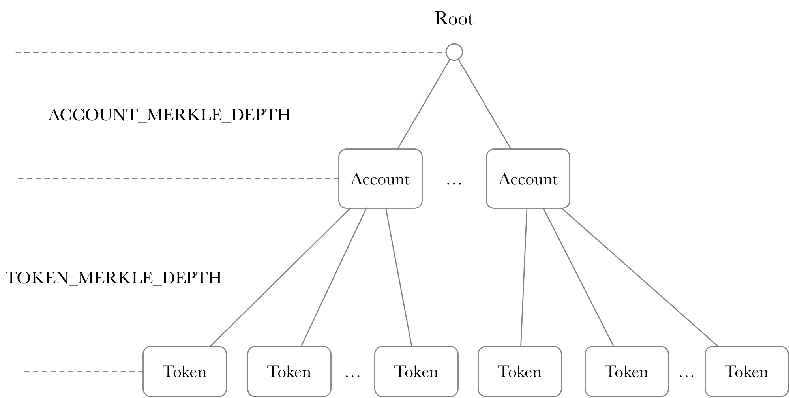

The Account node include the following fields:

|       Name        |  Type  | Size (bytes) |             Comments             |
| :---------------: | :----: | :----------: | :------------------------------: |
|    PubKeyHash     |   -    |      20      | Layer2 Address(Public Key Hash) |
|      Address      |   -    |      20      |          Layer1 Address          |
|       NONCE       | uint32 |      4       |   Nonce of Layer2 Transaction    |
|   **Token0 ID** | uint16 |      2       |   Token0 ID   |
|   **Token1 ID** | uint16 |      2       |   Token1 ID   |
|       **Reserve0**       | uint128 |      16       |   Reserve value of Token0    |
|       **Reserve1**       | uint128 |      16       |   Reserve value of Token1     |
|   **LP token ID** | uint16 |      2       |   Liquidity Provider Token ID   |
|       **LP Total Amount**       | uint128 |      16       |   Total amount of Liquidity Provider Token     |
| Balance Tree Root |   -    |      Fr      |           Fr of Bn256            |

The Token0 ID, Token1 ID, Reserve0, Reserve1, LP token ID and LP Total Amount fields are added for swap related operation, comparing with ZKSync's Account. 

ZKSwap protocol supports two account types: one is Account and the other is Pair Account. For Account, the additional information is useless and empty. For Pair Account, the additional fields should be filled correctly and the **PubKeyHash field is set to zero**. 

The Account "state" is calculated as follows:

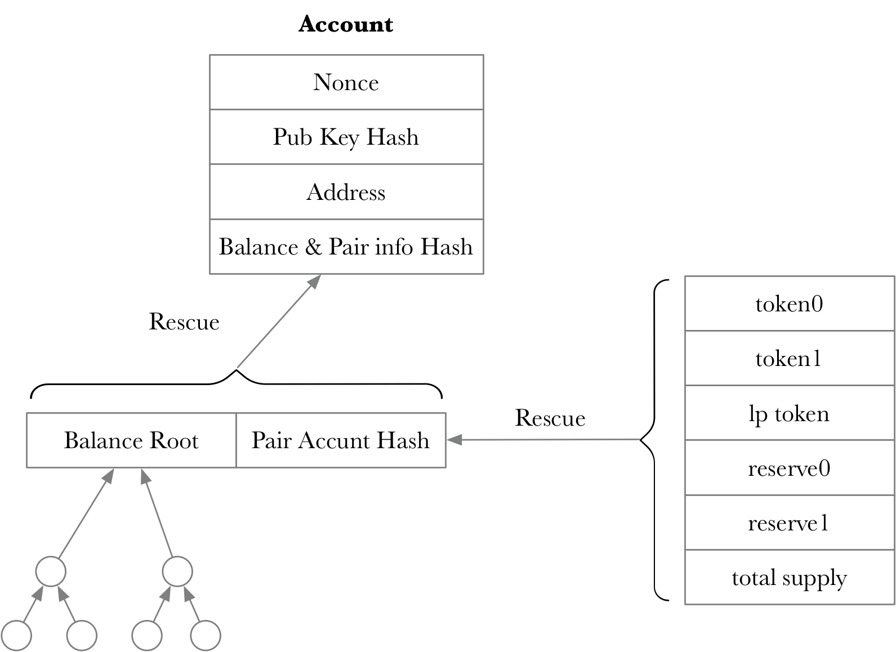

### 3. Token Management

The ZKSwap smart contract maintains a single list for tokens. The list is divided into two parts: one is for normal ETH/ERC20 tokens and the other is for LP ERC20 tokens. **Both tokens can be transferred in L1 and L2. And both tokens can be deposited and withdrawn between L1 and L2.**

#### a. Normal ERC20 token

In total 128 ERC20 tokens are supported with index from 0 to 127. The index 0 is reserved for ETH.

#### b. LP ERC20 token

In total 2,048 - 128 = 1,920 LP ERC20 tokens are supported and LP ERC20 tokens from index 128 to index 2,047.

In Layer2, each token is assigned one ID. The ID is synchronized between L1 and L2 through ZK rollup transactions.

### 4. Swap Operations

There are four swap related operations. **CreatePair** helps create the swap pair, which is composed of two different tokens. **AddLiquidity** and **RemoveLiquidity** operations are used to add and remove liquidity. **Swap** operation is used to swap one token for the other token.

All data types related in swap operations are listed as follows:

|           Name            |  Type   | Size (bytes) |    Comments    |
| :-----------------------: | :-----: | :----------: | :------------: |
|        ACCOUNT ID         | uint32  |      4       |                |
|         TOKEN ID          | uint16  |      2       |                |
|           NONCE           | uint32  |      4       |                |
|          AMOUNT           | uint128 |      16      |                |
|          ADDRESS          |         |      20      | Layer1 Address |
|   NEW_PUBKEY_HASH_WIDTH   |         |      20      | Layer2 Address |
| AMOUNT_EXPONENT_BIT_WIDTH |         |    5 bit     |                |
| AMOUNT_MANTISSA_BIT_WIDTH |         |    35 bit    |                |
|  FEE_EXPONENT_BIT_WIDTH   |         |    5 bit     |                |
|  FEE_MANTISSA_BIT_WIDTH   |         |    11 bit    |                |

#### a. CreatePair

The CreatePair operation starts from a L1 transaction. The ZKSwap smart contract helps create one pair for the ERC20 smart contract and one associated LP token. The pair ERC20 smart contract address is used in L2 to identify the swap pair. And the LP token address is used in L2 binding with the LP token ID.

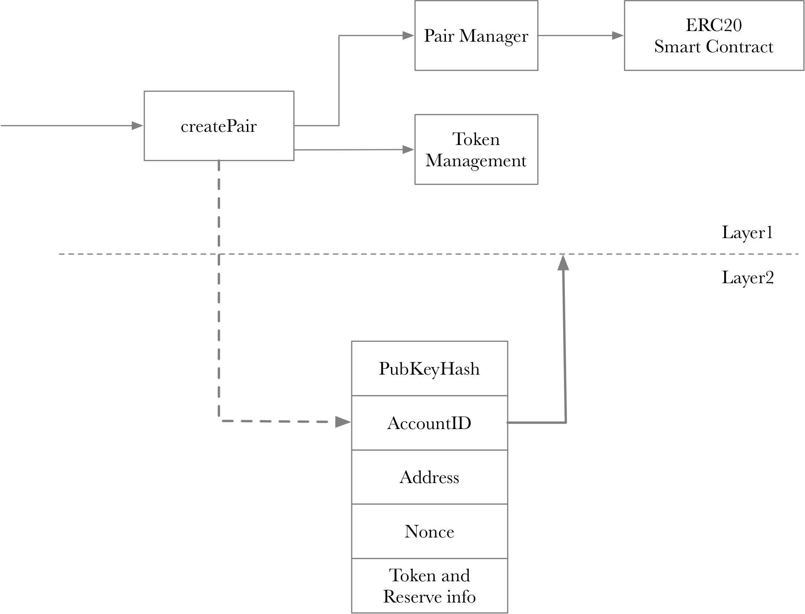

The pub data for CreatePair is listed as follows: 

|    Data     |    Type    | Size |     Comments      |
| :---------: | :--------: | :--: | :---------------: |
|     OP      |            |  1   |         8         |
|  accountId  | ACCOUNT ID |  4   | Layer2 account ID |
|  tokenIdA   |  TOKEN ID  |  2   |  Layer2 token ID  |
|  tokenIdB   |  TOKEN ID  |  2   |  Layer2 token ID  |
|  tokenPair  |  TOKEN ID  |  2   |   Pair token ID   |
| addressPair |  ADDRESS   |  20  |                   |

#### b. AddLiquidity

When one pair is created, a user can add liquidity to the pair by providing the two specified assets. The AddLiqudity operation starts from L2.

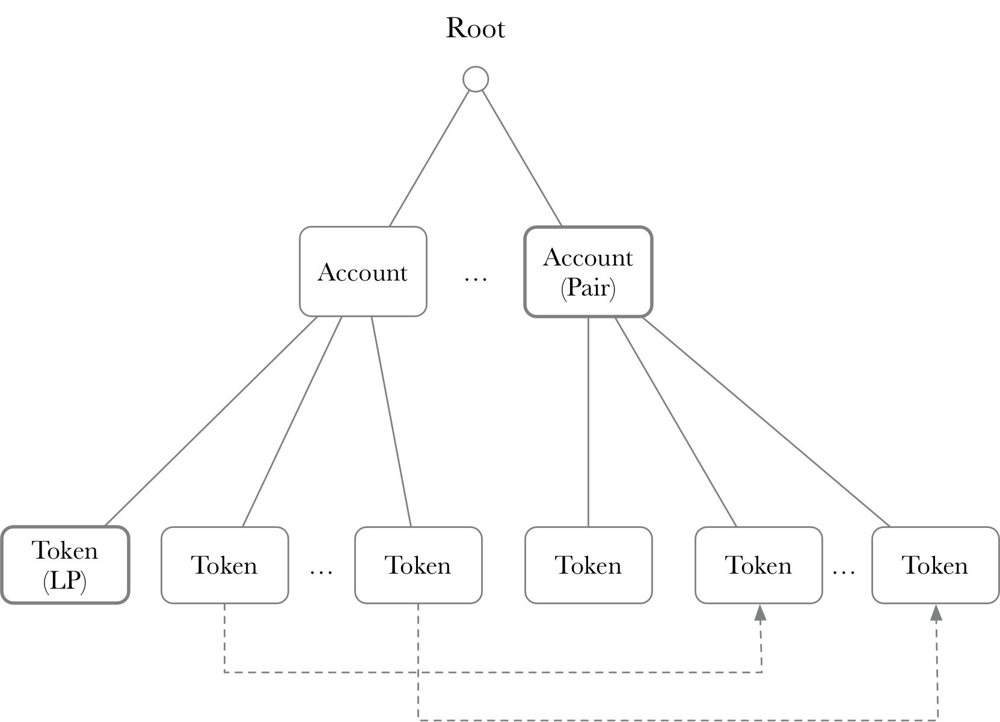

By adding liquidity, one account is rewarded with the liquidity token. The liquidity token is maintained in L2, and the liquidity token can be withdrawn to L1. 

The pub data for AddLiquidity is listed as follows: 

|     Data      |                         Type                          | Size |           Comments           |
| :-----------: | :---------------------------------------------------: | :--: | :--------------------------: |
|      OP       |                                                       |  1   |              9               |
|   accountId   |                      ACCOUNT ID                       |  4   |      Layer2 account ID       |
| accountPairId |                      ACCOUNT ID                       |  4   |      Layer2 account ID       |
| amountADesire | AMOUNT_EXPONENT_BIT_WIDTH + AMOUNT_MANTISSA_BIT_WIDTH |  5   | Layer2 tokenA desired amount |
|  amountAMin   | AMOUNT_EXPONENT_BIT_WIDTH + AMOUNT_MANTISSA_BIT_WIDTH |  5   |   Layer2 tokenA min amount   |
| amountBDesire | AMOUNT_EXPONENT_BIT_WIDTH + AMOUNT_MANTISSA_BIT_WIDTH |  5   | Layer2 tokenB desired amount |
|  amountBMin   | AMOUNT_EXPONENT_BIT_WIDTH + AMOUNT_MANTISSA_BIT_WIDTH |  5   |   Layer2 tokenB min amount   |
|     feeA      |    FEE_EXPONENT_BIT_WIDTH + FEE_MANTISSA_BIT_WIDTH    |  2   |    Layer2 tokenA fee = 0     |
|     feeB      |    FEE_EXPONENT_BIT_WIDTH + FEE_MANTISSA_BIT_WIDTH    |  2   |    Layer2 tokenB fee = 0     |
|    token0     |                       TOKEN ID                        |  2   |        token0 of pair        |
|    token1     |                       TOKEN ID                        |  2   |        token1 of pair        |
|    lpToken    |                       TOKEN ID                        |  2   |       lp Token of pair       |

#### c. RemoveLiquidity

Remove liquidity can be used to remove specified tokens from one pair. The RemoveLiquidity operation starts from L2, which is opposite from AddLiquidity.

The pub data for RemoveLiquidity is listed as follows:

|     Data      |                         Type                          | Size | Comments |
| :-----------: | :---------------------------------------------------: | :--: | :------: |
|      OP       |                                                       |  1   |    10    |
|   accountId   |                      ACCOUNT ID                       |  4   |          |
| accountPairId |                      ACCOUNT ID                       |  4   |          |
|  amountAMin   | AMOUNT_EXPONENT_BIT_WIDTH + AMOUNT_MANTISSA_BIT_WIDTH |  5   |          |
|     feeA      |    FEE_EXPONENT_BIT_WIDTH + FEE_MANTISSA_BIT_WIDTH    |  5   |    0     |
|  amountBMin   | AMOUNT_EXPONENT_BIT_WIDTH + AMOUNT_MANTISSA_BIT_WIDTH |  5   |          |
|     feeB      |    FEE_EXPONENT_BIT_WIDTH + FEE_MANTISSA_BIT_WIDTH    |  5   |    0     |
|  amountToken  | AMOUNT_EXPONENT_BIT_WIDTH + AMOUNT_MANTISSA_BIT_WIDTH |  5   |          |

#### d. Swap 

Swap is used to swap one token for another token, in the one pair account. From one pair account, the swap ratio depends on balances of the two specified tokens. Note that **swap operation is supported on one Account pair**. 


The pub data for Swap is listed as follows:

|     Data      |                         Type                          | Size |        Comments        |
| :-----------: | :---------------------------------------------------: | :--: | :--------------------: |
|      OP       |                                                       |  1   |           11           |
|   accountId   |                      ACCOUNT ID                       |  4   |                        |
|  accountToId  |                      ACCOUNT ID                       |  4   |                        |
| accountPairId |                      ACCOUNT ID                       |  4   |                        |
|   tokenId0    |                       TOKEN ID                        |  2   | Layer2 token ID (from) |
|   tokenId1    |                       TOKEN ID                        |  2   |  Layer2 token ID (to)  |
|   amountIn    | AMOUNT_EXPONENT_BIT_WIDTH + AMOUNT_MANTISSA_BIT_WIDTH |  5   |       amount in        |
| amountOutMin  | AMOUNT_EXPONENT_BIT_WIDTH + AMOUNT_MANTISSA_BIT_WIDTH |  5   |     min amount out     |
|     fee0      |    FEE_EXPONENT_BIT_WIDTH + FEE_MANTISSA_BIT_WIDTH    |  2   |      swap fee = 0      |
|     fee1      |    FEE_EXPONENT_BIT_WIDTH + FEE_MANTISSA_BIT_WIDTH    |  2   |      swap fee = 0      |

### 5. Circuit Design

The global state of L2 is updated by transaction execution and verified again by circuit. When one transaction is applied on circuit, it is "divided" into OperationBranch and Operation Arguments. OperationBranch describes the Merkel path. Operation Arguments describe all other information besides branches.

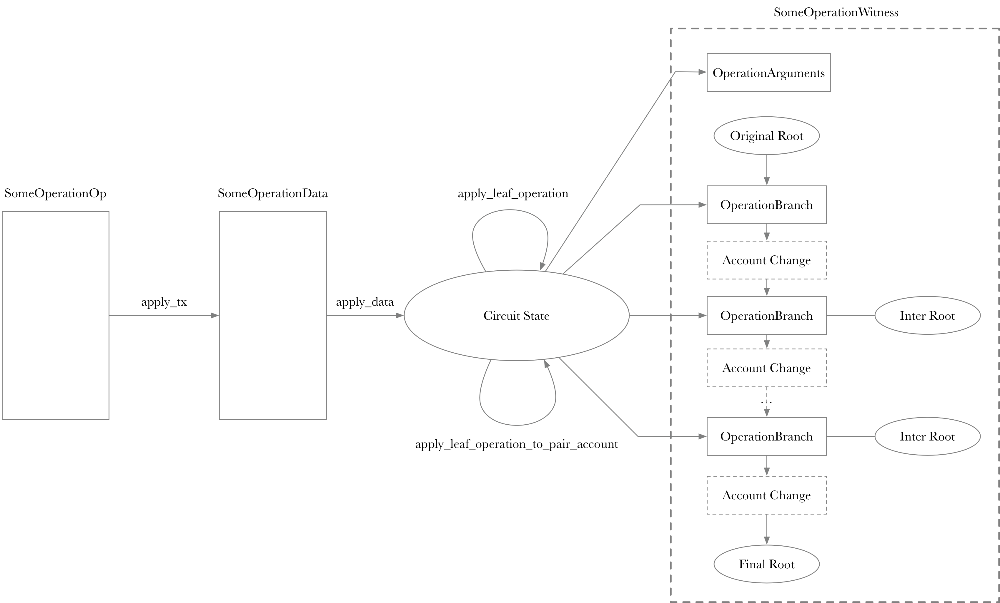

Operation is an important structure, which is the "smallest" circuit block.

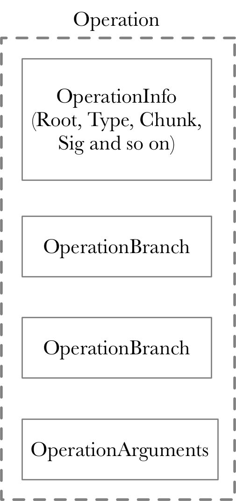

One logic transaction is split into several operations. And one block can support dynamically different operation numbers:

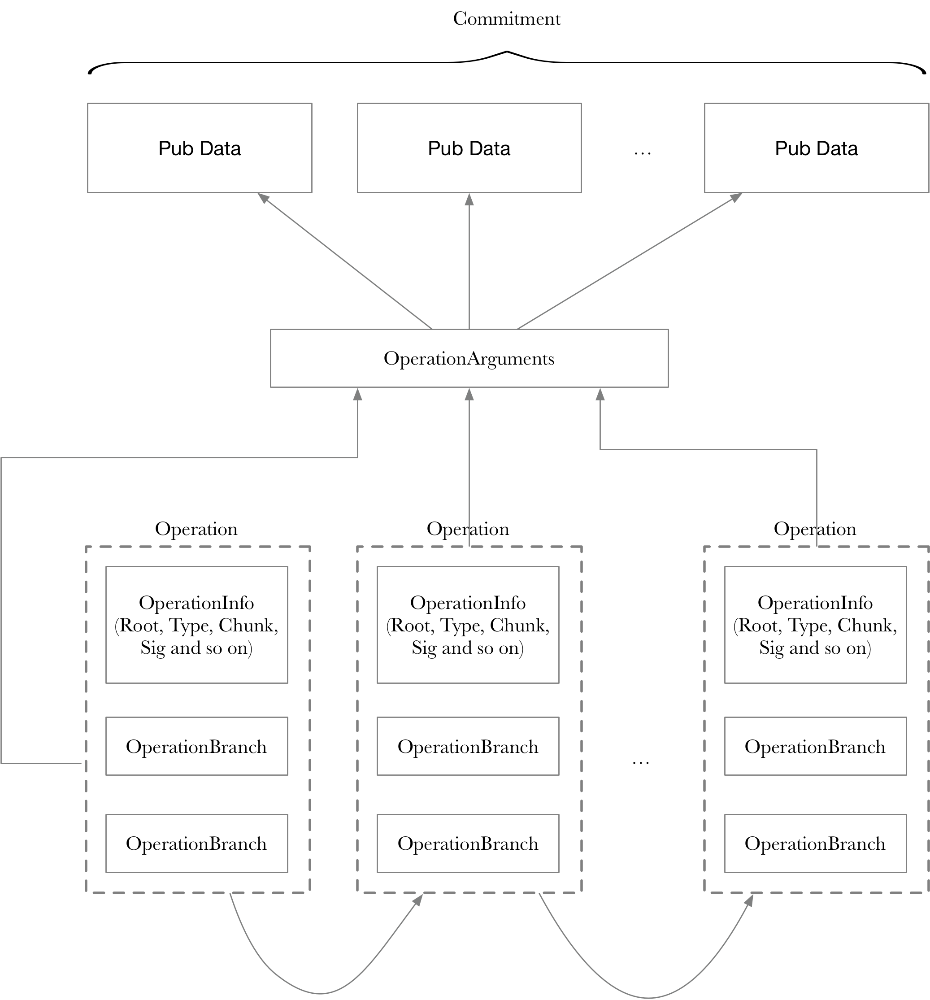

#### 5.a CreatePair

The CreatePair circuit tries to create one pair account with the specified token information.

```python
# CreatePairOp - Rollup operation 
# OnchainOp - public data generated by executing this rollup op

account = get_account_tree(CreatePairOp.account_id)

def tree_invariants():
   is_pair_account_empty(account) == True 

def tree_updates():
   account.address = CreatePairOp.op.pair_address
   account.token0 = CreatePairOp.op.token_a
   account.token1 = CreatePairOp.op.token_b
   account.lp_token = CreatePairOp.op.token_liquidity

def pubdata_invariants():
   OnchainOp.op_code = 0x08
   OnchainOp.token0 = CreatePairOp.op.token_a
   OnchainOp.token1 = CreatePairOp.op.token_b
   OnchainOp.lp_token = CreatePairOp.op.token_liquidity
   OnchainOp.pair_address = CreatePairOp.op.pair_address
```

#### 5.b AddLiquidity

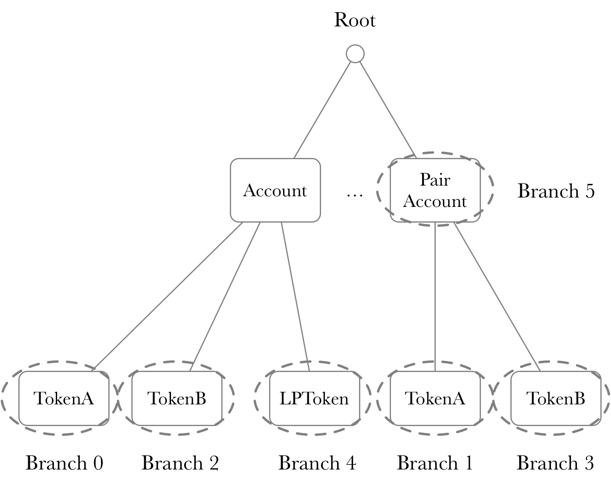

```python
# AddLiquidityOp - Rollup operation 
# OnchainOp      - public data generated by executing this rollup op

from_account = get_account_tree(AddLiquidityOp.from_id)
pair_account = get_account_tree(AddLiquidityOp.to_id)

t0 = AddLiquidityOp.tx.token0
t1 = AddLiquidityOp.tx.token1
lp_token = AddLiquidityOp.tx.token_liquidity

fee0 = unpack_fee(AddLiquidityOp.tx.packed_fee0)
fee1 = unpack_fee(AddLiquidityOp.tx.packed_fee1)

total_supply = pair_account.total_supply
r0 = pair_account.reserve0
r1 = pair_account.reserve1

a0_desired = unpack_amount(AddLiquidityOp.tx.packed_amount0_desired)
a0_min = unpack_amount(AddLiquidityOp.tx.packed_amount0_min)

a1_desired = unpack_amount(AddLiquidityOp.tx.packed_amount1_desired)
a1_min = unpack_amount(AddLiquidityOp.tx.packed_amount1_min)

if (r0 == 0 and r1 == 0):
   a0, a1 = a0_desired, a1_desired
else:
   a1Opt = a0_desired * r1 / r0
   if a1Opt <= a1_desired: 
      a0, a1 = a0_desired, a1Opt
   else:
      a0Opt = a1_desired * r0 / r1
      a0, a1 = a0Opt, a1_desired

if r0 == 0 and r1 == 0:
   liquidity = sqrt(a0*a1)
else:
   liquidity = min(a0*total_supply/r0, a1*total_supply/r1)

def tree_invariants():
   is_pair_account_empty(pair_account) == False
   a0_min <= a0 and a0 <= a0_desired
   a1_min <= a1 and a1 <= a1_desired

   fee0 == 0 and fee1 == 0 # do not charge any fees  
   from_account.id == AddLiquidityOp.tx.from_account_id
   from_account.nonce == AddLiquidityOp.tx.nonce
   from_account.nonce < MAX_NONCE

   from_account.balance[t0] >= a0+fee0
   from_account.balance[t1] >= a1+fee1
   from_account.pubkey_hash == recover_signer_pubkey_hash(AddLiquidityOp.tx)
   from_account.address == AddLiquidityOp.tx.from_address
   pair_account.address == AddLiquidityOp.tx.to_address

   if r0 == 0 and r1 == 0:
      liquidity >= 1000
   else 
      liquidity > 0


def tree_updates():
   from_account.balance[t0] -= (a0+fee0)
   from_account.balance[t1] -= (a1+fee1)
   from_account.balance[lp_token] += liquidity
   from_account.nonce += 1

   pair_account.balance[t0] += a0
   pair_account.balance[t1] += a1
   pair_account.reserve0 = pair_account.balance[t0]
   pair_account.reserve1 = pair_account.balance[t1] 
   pair_account.total_supply += liquidity


def pubdata_invariants():
   OnchainOp.op_code == 0x09
   OnchainOp.from_account == AddLiquidityOp.from_id
   OnchainOp.pair_account == AddLiquidityOp.to_id
   OnchainOp.a0_desired_packed = AddLiquidityOp.tx.packed_amount0_desired
   OnchainOp.a0_min_packed = AddLiquidityOp.tx.packed_amount0_min
   OnchainOp.a1_desired_packed = AddLiquidityOp.tx.packed_amount1_desired
   OnchainOp.a1_min_packed = AddLiquidityOp.tx.packed_amount1_min
   OnchainOp.fee_packed = AddLiquidityOp.tx.packed_fee
   OnchainOp.fee2_packed = AddLiquidityOp.tx.packed_fee2
   OnchainOp.t0 == AddLiquidityOp.tx.token0
   OnchainOp.t1 == AddLiquidityOp.tx.token1
   OnchainOp.lp_token == AddLiquidityOp.tx.token_liquidity
```

#### 5.c RemoveLiquidity

The RemoveLiquidity operation is the reverse of AddLiquidity.

```python
# RemoveLiquidityOp - Rollup operation 
# OnchainOp         - public data generated by executing this rollup op

from_account = get_account_tree(RemoveLiquidityOp.from_id)
pair_account = get_account_tree(RemoveLiquidityOp.to_id)

lp_token = RemoveLiquidityOp.tx.token_liquidity
t0 = RemoveLiquidityOp.tx.token0
t1 = RemoveLiquidityOp.tx.token1

lp_amount = unpack_amount(RemoveLiquidityOp.tx.packed_amount_liquidity)
fee0 = unpack_fee(RemoveLiquidityOp.tx.packed_fee0)
fee1 = unpack_fee(RemoveLiquidityOp.tx.packed_fee1)

a0_min = unpack_amount(RemoveLiquidity.tx.packed_amount0_min)
a1_min = unpack_amount(RemoveLiquidity.tx.packed_amount1_min)

b0 = pair_account.balance[t0]
b1 = pair_account.balance[t1]
total_supply = pair_account.total_supply

a0 = lp_amount*b0/total_supply
a1 = lp_amount*b1/total_supply

def tree_invariants():
   is_pair_account_empty(pair_account) == False
   from_account.balance[lp_token] >= lp_amount
   from_account.nonce < MAX_NONCE
   from_account.pubkey_hash == recover_signer_pubkey_hash(RemoveLiquidityOp.tx)
   from_account.address == RemoveLiquidityOp.tx.from_address
   pair_account.address == RemoveLiquidityOp.tx.to_address
  
   fee0 == 0 and fee1 == 0
   a0 >= a0_min and a1 >= a1_min

def tree_updates():
   from_account.balance[lp_token] -= lp_amount
   from_account.nonce += 1
   from_account.balance[t0] += (a0-fee0)
   from_account.balance[t1] += (a1-fee1)

   pair_account.balance[t0] -= a0
   pair_account.balance[t1] -= a1
   pair_account.total_supply -= lp_amount
   pair_account.reserve0 = pair_account.balance[t0]
   pair_account.reserve1 = pair_account.balance[t1]

def pubdata_invariants():
   OnchainOp.op_code == 0x0a 
   OnchainOp.from_account_id == RemoveLiquidityOp.tx.from_id
   OnchainOp.pair_account_id == RemoveLiquidityOp.tx.to_id
   OnchainOp.amount0_min_packed == RemoveLiquidityOp.tx.packed_amount0_min
   OnchainOp.fee0_packed == RemoveLiquidityOp.tx.packed_fee0
   OnchainOp.amount1_min_packed == RemoveLiquidityOp.tx.packed_amount1_min
   OnchainOp.fee1_packed == RemoveLiquidityOp.tx.packed_fee1
   OnchainOp.lp_amount_packed == RemoveLiquidityOp.tx.packed_amount_liquidity
```

#### 5.d Swap

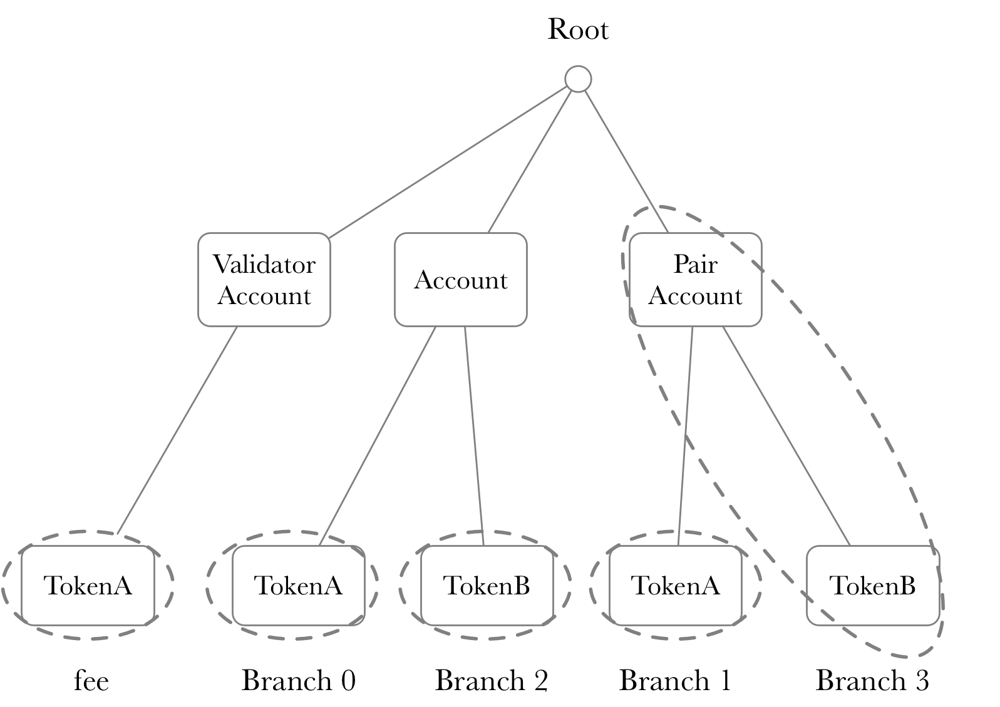

```python
# SwapOp    - Rollup operation 
# Block     - block in which this rollup operation is executed
# OnchainOp - public data generated by executing this rollup operation

from_account = get_account_tree(SwapOp.from_id)
pair_account = get_account_tree(SwapOp.pair_id)
fee_account = get_account_tree(Block.fee_account)

tin = SwapOp.tx.token_in
tout = SwapOp.tx.token_out

if tin == pair_account.token0:
   rin, rout = pair_account.reserve0, pair_account.reserve1
else:
   rin, rout = pair_account.reserve1, pair_account.reserve0   

aout_min = unpack_amount(SwapOp.tx.packed_amount_out_min)

ain = unpack_amount(SwapOp.tx.packed_amount_in)
ain_with_fee = ain*997

aout = rout*ain_with_fee/(ain_with_fee+rin*1000)
val_fee = ain - ain*9995/10000

lp_token = pair_account.lp_token

def tree_invariants():
   is_pair_account_empty(pair_account) == False
   (tin == pair_account.token0 and tout == pair_account.token1) or
      (tin == pair_account.token1 and tout == pair_account.token0)
   from_account.balance[tin] >= ain
   from_account.nonce < MAX_NONCE
   from_account.pubkey_hash == recover_signer_pubkey_hash(SwapOp.tx)
   from_account.address == SwapOp.tx.from_address
   pair_account.address == SwapOp.tx.to_address

def tree_updates():
   from_account.balance[tin] -= ain
   from_account.nonce += 1
   from_account.balance[tout] += aout

   pair_acount.balance[tin] += ain - ain*5/10000
   pair_account.balance[tout] -= aout
   if tin == pair_account.token0:
      pair_account.reserve0 = pair_account.balance[tin]
      pair_account.reserve1 = pair_account.balance[tout]
   else:
      pair_account.reserve1 = pair_account.balance[tin]
      pair_account.reserve0 = pair_account.balance[tout]

def pubdata_invariants():
   OnchainOp.op_code == 0x0b
   OnchainOp.from_account_id == SwapOp.from_id
   OnchainOp.to_account_id == SwapOp.from_id
   OnchainOp.pair_account_id == SwapOp.pair_id
   OnchainOp.token_in == SwapOp.tx.token_in
   OnchainOp.token_out == SwapOp.tx.token_out
   OnchainOp.amount_in_packed == SwapOp.tx.packed_amount_in
   OnchainOp.amount_out_min_packed == SwapOp.tx.packed_amount_out_min
   OnchainOp.fee_in_packed == SwapOp.tx.packed_fee_in
   OnchainOp.fee_out_packed == SwapOp.tx.packed_fee_out
```

### 6. Fee Model

In ZKSwap protocol there is a fee for the Swap operation, but no fees for the other operations.

|            OP name             | OP number | Fee  |    FeeTo     |          Comments          |
| :----------------------------: | :-------: | :--: | :----------: | :------------------------: |
|              Noop              |     0     |  0   |              |                            |
|        Deposit         |     1     |  0   |              |          Layer 1           |
| TransferToNew  |     2     |  0   |     |                            |
|        Withdraw        |     3     |  0   |     |                            |
|       Close        |     4     |  0   |              | Dedicated and not supported |
|        Transfer        |     5     |  0   |     |                            |
|        FullExit        |     6     |  0   |              | Layer 1 |
| ChangePubKey |     7     |  0   |              |                            |
|     CreatePair     |     8     |  0   |              |          Layer 1           |
|   AddLiquidity   |     9     |  0   |     |                            |
| RemoveLiquidity |    10     |  0   |     |                            |
|          Swap          |    11     | 0.3% | LP/Operator | 0.25% LP + 0.05% Operator |

### 7. Exodus Mode

If a L1 request is NOT handled in **3 days**, ZKSwap protocol enters exodus mode, which applies to the entire ZKSwap platform. If exodus mode is on, users can and should provide proof of assets on L2 and withdraw to L1.

Basically, there are two kinds of assets from the exodus mode point of view: one is a normal ERC20 token and the other is liquidity tokens in one pair.

#### a. Normal ERC20 Token

For normal ERC20 token, one Merkle path should be verified with the latest Merkle root. 

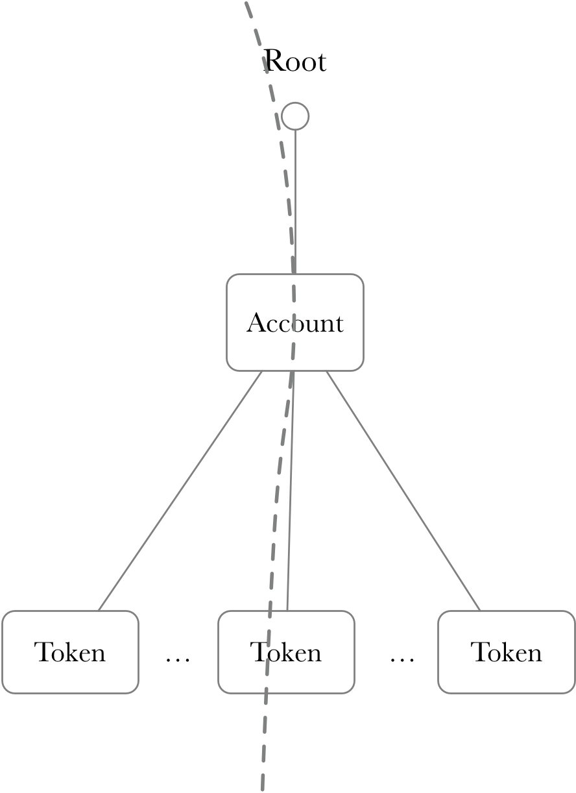

#### b. LP ERC20 Token

If one user tries to withdraw assets in one Pair account to L1 on exodus mode, one user should provide the proof about LP ERC20 token amount and correct Pair account information. Due to the fact, LP ERC20 token can be spreaded between L1 and L2. If exodus mode, **the amount LP token is the total amount of L1 and L2**. 

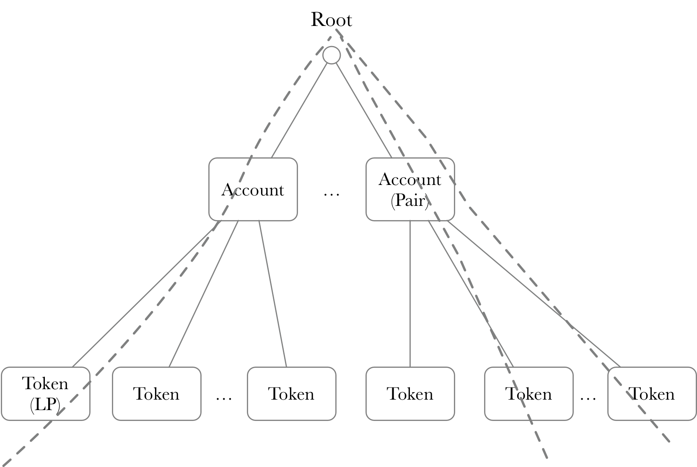

```python
# LP Exit Circuit - LP Exit for Exodus mode
# OnchainOp - public data generated for lp exit

pair_b0_root = check_account_data(pair_b0_branch)
pair_b1_root = check_account_data(pair_b1_branch)
from_root = check_account_data(from_branch)
is_pair_account_empty = check_pair_account(pair_b0_branch.pair_account)

x0 = (from_branch.balance + eth_lp_amount)*pair_b0_branch.balance/pair_b0_branch.pair_account.total_supply
x1 = (from_branch.balance + eth_lp_amount)*pair_b1_branch.balance/pair_b0_branch.pair_account.total_supply

final_hash = sha256(
   root_hash,
   from_branch.account_id,
   from_branch.account.address,
   from_branch.balance,
   eth_lp_amount,
   pair_b0_branch.account_id,
   pair_b0_branch.account.address,
   pair_b0_branch.pair_account.lp_token,
   pair_b0_branch.pair_account.token0,
   pair_b0_branch.pair_account.token1,
   pair_b0_branch.balance,
   pair_b1_branch.balance,
   x0,
   x1
);

def tree_invariants():
   # root is consistent 
   pair_b0_root == root_hash
   pair_b1_root == root_hash
   from_root == root_hash
   # token is consistent
   from_branch.token == lp_token
   pair_b0_branch.token == token0
   pair_b1_branch.token == token1
   pair_b0_branch.pair_account.lp_token == lp_token
   pair_b1_branch.pair_account.lp_token == lp_token
   is_pair_account_empty == false
   # same pair
   pair_b0_branch.lp_token == pair_b1_branch.lp_token
   pair_b0_branch.token0 == pair_b1_branch.token0
   pair_b0_branch.token1 == pair_b1_branch.token1
   pair_b0_branch.reserve0 == pair_b1_branch.reserve0
   pair_b0_branch.reserve1 == pair_b1_branch.reserve1
   pair_b0_branch.total_supply == pair_b1_branch.total_supply
```

